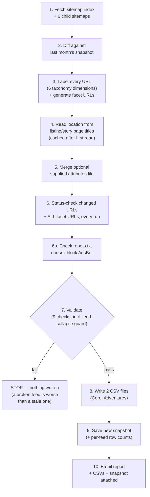
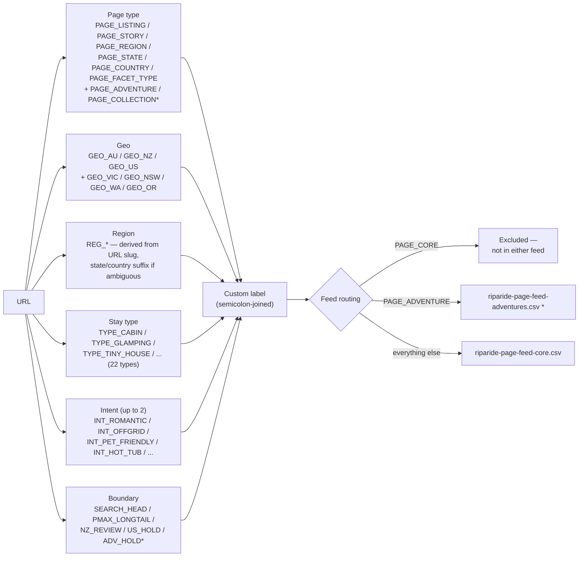
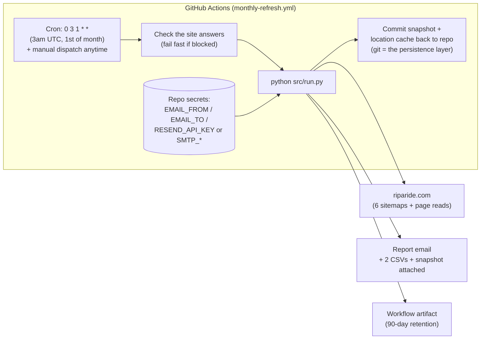

# Riparide Page Feed — Project Status

**Last updated:** 27 August 2026 (post scope-cross-check fixes + GitHub Actions migration)
**Purpose of this document:** a plain-language, accurate snapshot of this project for a client status update (Loom recording). Covers what was asked for, what's been built, how it runs today, and what's still open.

---

## 1. What this project is, in one paragraph

Riparide's Google Ads Performance Max campaigns are currently running **feedless** — Google is only told about pages through asset groups and site-wide URL crawling, not an explicit list. That means PMax often serves generic landing pages (homepage, category pages) even when a search matches a very specific listing or location. This project builds an automated **page feed**: a machine-generated, monthly-refreshed spreadsheet that tells Google Ads exactly which URLs exist on riparide.com and how each one should be labeled (location, stay type, intent, etc.), so Performance Max can match ads to the right page instead of guessing.

---

## 2. Why it exists (the business case)

From the SNR research this project is built against:

- PMax's best-performing inventory today is already listing-name and location long-tail (~$33 CPA / 3.9 ROAS) — **despite** running feedless.
- Search Generic already beats PMax by 2x+ on four specific query clusters: romantic, getaways, off-grid, pet-friendly.
- The strategic question this unlocks is a **PMax vs Search role-split test** (Option A vs Option B) — but that test's own prerequisite, on record, is: *"brand negatives live and Page Feeds built — neither option is worth testing on the current feedless setup."*

In short: this feed isn't the end goal, it's the unlock for a bigger experiment that's currently blocked without it.

---

## 3. What was actually specified

The spec (SNR, 24 Aug 2026) calls for:

1. A feed covering all listing pages + programmatic landing pages (location pages, facet pages like tiny-homes, hot-tub, pet-friendly, glamping, cabins).
2. A label taxonomy so asset groups can be restructured around labels (e.g. `listings-nsw`, `facet-tiny-homes`, `location-blue-mountains`).
3. Asset groups rebuilt around those labels (Google Ads side, not this codebase).
4. URL expansion constrained so PMax serves from the feed, not a site-wide crawl (Google Ads account setting).
5. A 6-week read comparing feed-anchored CPA/ROAS against the pre-feed baseline.

A companion build spec defines the exact CSV format, hard validation rules, and a **6-dimension label taxonomy** — page type, geo, region, stay type, intent, and a "boundary" dimension that encodes the Search-vs-PMax role split directly into the feed (`SEARCH_HEAD` / `PMAX_LONGTAIL` / `NZ_REVIEW` / `US_HOLD`).

---

## 4. What has actually been built

This is a **standalone, dependency-free Python job** (no third-party libraries — deliberate, see §6) that automates the entire feed-building pipeline end to end.

### 4.1 Pipeline — what one monthly run does

If validation fails at step 7, the run stops **before writing anything** — last month's files and snapshot stay intact. Step 6b and the feed-collapse guard in step 7 were both added this session (see §5).

### 4.2 How a URL becomes a labeled row

\* `PAGE_ADVENTURE`/`PAGE_COLLECTION` and the separate Adventures feed file are **not in the original spec** — the build discovered these content types on the live sitemap and added handling for them. Flagged for client confirmation in §7.

### 4.3 What's genuinely done and working

| Area | Status |
|---|---|
| Sitemap crawling (6 sitemaps) | ✅ Built, using the only HTTP client the site accepts (see §6) |
| 6-dimension labeling | ✅ Built, matches spec's taxonomy, **including the previously-missing "getaway" keyword** |
| Facet URL generation (query-string, alphabetical param order) | ✅ Built, **and now status-checked every run** (was previously untested by default) |
| Location recovery from listing/story page titles | ✅ Built — cached, so only new pages are fetched each month |
| Optional attributes-file merge | ✅ Built, not yet in use (no file supplied yet) |
| Month-to-month change detection (diff) | ✅ Built and self-tested (`prove_diff.py`, runs in CI on every push) |
| robots.txt / AdsBot-Google check | ✅ Added — reports (non-blocking) if AdsBot is blocked from any feed page type |
| Pre-upload validation (now 9 checks) | ✅ Built — duplicates, missing labels, label count, tracking params, domain, facet param order, dead links, label character set, **and a new feed-collapse guard** |
| Automatic 6-monthly full status check | ✅ Now genuinely automatic (Jan/Jul) — previously only a recommendation nobody had wired up |
| CSV output in Google's exact 2-column format | ✅ Built |
| Email report with both files + the snapshot attached | ✅ Built — supports Resend API or SMTP, fails safely (reports "not sent") if unconfigured |
| Unit test suite (86 tests) + CI | ✅ Added this session — covers labelling, validation, attributes, location parsing, and the new robots.txt check |
| Scheduled + manual run via GitHub Actions | ✅ Built — replaces Railway entirely (see 4.4) |

### 4.4 How it currently runs (deployment, today)

**Railway is no longer used.** `railway.json` has been removed and the state that used to live on its volume now lives as ordinary git commits made by the workflow itself — reviewable in the repo's history like any other change. This also means a run failure shows up as a red GitHub Actions run, which GitHub emails repo watchers about automatically, on top of this project's own report email.

**One thing this hasn't proven yet:** whether GitHub's own runner network can actually reach riparide.com. The site's block turned out to be based on more than just which HTTP client is used (see §6) — a normal residential/office connection got blocked outright during this review, which is new information the original design didn't account for. The workflow's first step exists specifically to fail loudly and immediately if this doesn't hold, but **the very first real run needs to be watched** to confirm it, rather than assumed safe because it worked from Railway.

---

## 5. Gaps found against the spec — status now

These were found by cross-checking the built code line-by-line against the spec. All but one have been fixed and are covered by new automated tests; the last one is a business/data decision, not a code fix, and is still open.

| # | Gap | Status |
|---|---|---|
| 1 | "Getaways" query cluster had no keyword — Option B could never exclude those pages from PMax | ✅ **Fixed** — keyword added, boundary set correctly, regression-tested |
| 2 | ~132 facet URLs were never live-checked for 200-vs-redirect status in a normal monthly run | ✅ **Fixed** — every facet URL is now checked every run regardless of flags |
| 3 | No robots.txt / AdsBot-Google check anywhere | ✅ **Fixed** — added, reported in every run's email (non-blocking by design, see below) |
| 4 | D4's "full status check every 6 months" was a recommendation nobody had wired up | ✅ **Fixed** — now automatic in January and July |
| 5 | Nothing would catch a feed silently collapsing to near-zero rows (e.g. during a site/network outage) | ✅ **Fixed and proven** — reproduced the exact failure deliberately, confirmed the new guard stops it before anything is written |
| 6 | Facet pages tagged `SEARCH_HEAD` by stay type — not backed by anything in the spec | ⚠️ **Still open** — flagged clearly in code and DECISIONS.md, needs an explicit answer from SNR/the client, not a code change |
| 7 | Adventures/Collections content types and their separate feed handling aren't in the original spec | ⚠️ **Still open** — same as above, a confirmation needed rather than a bug |

None of the fixes above were large changes, but leaving any of them unresolved would have undermined the actual experiment the feed exists to support (a bad facet URL or a missing exclusion keyword directly affects the Option A/B read).

---

## 6. One important constraint worth mentioning to the client

Riparide's site fingerprints and blocks common tools (`requests`, `curl`) even when they send the same browser identity as a real browser — verified directly against the live site. That's why this is built with zero third-party dependencies, using only Python's built-in HTTP client, which the site does accept.

**New finding this session:** it's not only about which client library is used. A completely ordinary residential/office internet connection, using the exact same accepted client and browser identity, was blocked on *every single page* — including the robots.txt file itself. That points to the site (via Cloudflare) also blocking based on where the request is coming from, not just what's making it. This is why the job can only run from cloud infrastructure, and why the GitHub Actions setup (§4.4) includes an explicit "does this even work" check rather than assuming it does.

---

## 7. Open decisions for the client

- Confirm whether facet pages should really be tagged `SEARCH_HEAD` by stay type (tiny house, cabin, glamping, cottage) — this wasn't in the spec and needs a yes/no before the Option A/B split goes live.
- Confirm whether Adventures pages should have their own feed/asset-group treatment, since this wasn't part of the original spec.
- Confirm ownership/timing for the still-manual steps: brand negatives, asset-group restructuring around labels, and the URL-expansion account setting — none of these are things this codebase can do.
- **Watch the first real GitHub Actions run.** Everything above is verified by code and tests running locally; the one thing that can only be confirmed by actually watching a live scheduled or manually-triggered run is whether GitHub's infrastructure can reach riparide.com the way Railway's did.
