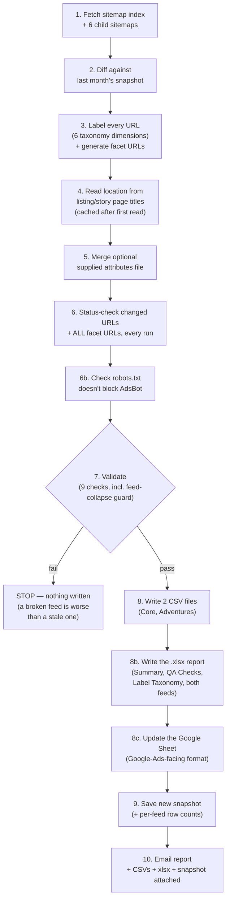
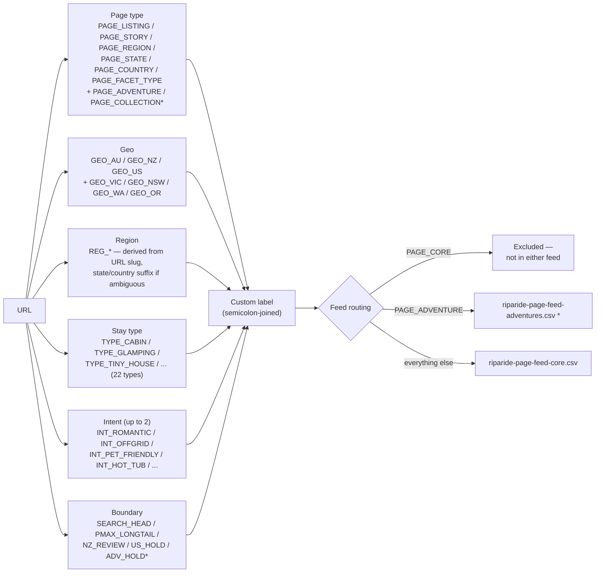
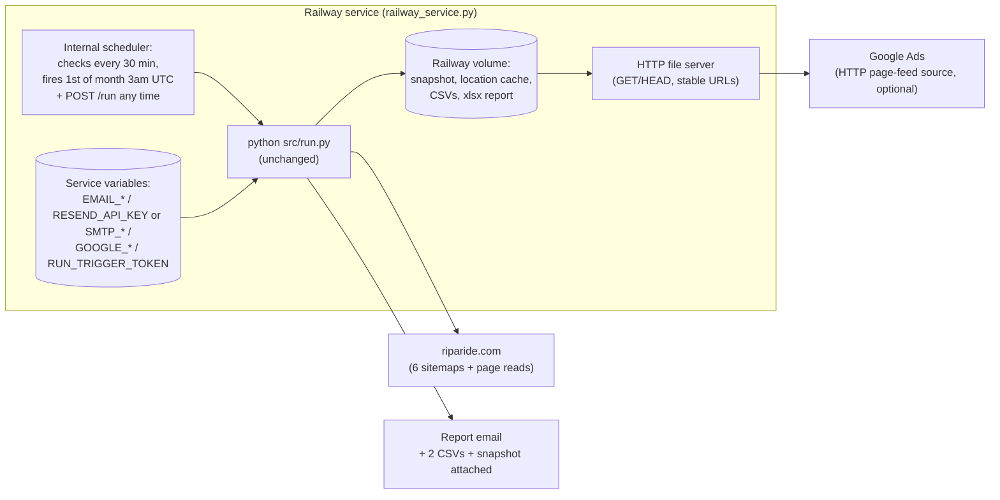

# Riparide Page Feed — Project Status

**Last updated:** 31 August 2026 (moved off GitHub Actions onto a single Railway service — see 4.4, the deployment section, for the current, more complicated truth: the new setup is built and tested as far as possible, but not yet actually deployed on live Railway infrastructure)
**Purpose of this document:** a plain-language, accurate snapshot of this project for a client status update (Loom recording). Covers what was asked for, what's been built, how it runs today, and what's still open.

---

## 1. What this project is, in one paragraph

Riparide's Google Ads Performance Max campaigns are currently running **feedless** — Google is only told about pages through asset groups and site-wide URL crawling, not an explicit list. That means PMax often serves generic landing pages (homepage, category pages) even when a search matches a very specific listing or location. This project builds an automated **page feed**: a machine-generated, monthly-refreshed spreadsheet that tells Google Ads exactly which URLs exist on riparide.com and how each one should be labeled (location, stay type, intent, etc.), so Performance Max can match ads to the right page instead of guessing.

---

## 2. Why it exists (the business case)

From the SNR research this project is built against:

- PMax's best-performing inventory today is already listing-name and location long-tail (~$33 CPA / 3.9 ROAS) — **despite** running feedless.
- Search Generic already beats PMax by 2x+ on four specific query clusters: romantic, getaways, off-grid, pet-friendly.
- The strategic question this unlocks is a **PMax vs Search role-split test** (Option A vs Option B) — but that test's own prerequisite, on record, is: *"brand negatives live and Page Feeds built — neither option is worth testing on the current feedless setup."*

In short: this feed isn't the end goal, it's the unlock for a bigger experiment that's currently blocked without it.

---

## 3. What was actually specified

The spec (SNR, 24 Aug 2026) calls for:

1. A feed covering all listing pages + programmatic landing pages (location pages, facet pages like tiny-homes, hot-tub, pet-friendly, glamping, cabins).
2. A label taxonomy so asset groups can be restructured around labels (e.g. `listings-nsw`, `facet-tiny-homes`, `location-blue-mountains`).
3. Asset groups rebuilt around those labels (Google Ads side, not this codebase).
4. URL expansion constrained so PMax serves from the feed, not a site-wide crawl (Google Ads account setting).
5. A 6-week read comparing feed-anchored CPA/ROAS against the pre-feed baseline.

A companion build spec defines the exact CSV format, hard validation rules, and a **6-dimension label taxonomy** — page type, geo, region, stay type, intent, and a "boundary" dimension that encodes the Search-vs-PMax role split directly into the feed (`SEARCH_HEAD` / `PMAX_LONGTAIL` / `NZ_REVIEW` / `US_HOLD`).

---

## 4. What has actually been built

This is a **standalone Python job** — stdlib-only for everything that talks to riparide.com (deliberate, see §6), with two narrow exceptions (`openpyxl` for the local `.xlsx` report, `google-auth` for the Google Sheets integration below — neither ever touches riparide.com) — that automates the entire feed-building pipeline end to end, delivering the result in two independent formats every run: the **client-shared format** (CSVs + `.xlsx`, emailed) and the **Google-Ads-facing format** (a Google Sheet Google Ads reads from directly).

### 4.1 Pipeline — what one monthly run does

If validation fails at step 7, the run stops **before writing anything** — last month's files and snapshot stay intact. Step 8c is the one deliberate exception to that rule once past step 7: if the Sheets update itself fails (bad credentials, sheet not shared correctly, a Google API hiccup), the CSVs/xlsx/email still complete anyway — a good feed must never be lost over one delivery channel's problem — but the run is still marked failed so it's never silently missed. Steps 6b, 8b, 8c, and the feed-collapse guard in step 7 were all added this session (see §5).

### 4.2 How a URL becomes a labeled row

\* `PAGE_ADVENTURE`/`PAGE_COLLECTION` and the separate Adventures feed file are **not in the original spec** — the build discovered these content types on the live sitemap and added handling for them. Flagged for client confirmation in §7.

### 4.3 What's genuinely done and working

| Area | Status |
|---|---|
| Sitemap crawling (6 sitemaps) | ✅ Built, using the only HTTP client the site accepts (see §6) |
| 6-dimension labeling | ✅ Built, matches spec's taxonomy, **including the previously-missing "getaway" keyword** |
| Facet URL generation (query-string, alphabetical param order) | ✅ Built, **and now status-checked every run** (was previously untested by default) |
| Location recovery from listing/story page titles | ✅ Built — cached, so only new pages are fetched each month |
| Optional attributes-file merge | ✅ Built, not yet in use (no file supplied yet) |
| Month-to-month change detection (diff) | ✅ Built and self-tested (`prove_diff.py`, runs in CI on every push) |
| robots.txt / AdsBot-Google check | ✅ Added — reports (non-blocking) if AdsBot is blocked from any feed page type |
| Pre-upload validation (now 9 checks) | ✅ Built — duplicates, missing labels, label count, tracking params, domain, facet param order, dead links, label character set, **and a new feed-collapse guard** |
| Automatic 6-monthly full status check | ✅ Now genuinely automatic (Jan/Jul) — previously only a recommendation nobody had wired up |
| CSV output in Google's exact 2-column format | ✅ Built |
| **`.xlsx` report** (Summary, QA Checks, Label Taxonomy, both feeds as real sheets) | ✅ **New this session** — committed to the repo every run (`reports/`) and emailed, per your request |
| Email report with CSVs + xlsx + snapshot attached | ✅ Built — kept as plain text by your choice (reviewed, judged not worth the polish for an ops-facing report); supports Resend API or SMTP, fails safely if unconfigured |
| Unit test suite (115+ tests) + CI | ✅ Covers labelling, validation, attributes, location parsing, the robots.txt check, the xlsx report, and the Google Sheets integration (mocked, no live credentials needed) |
| Scheduled + manual run | ⚠️ Built on Railway (`railway_service.py`), replacing GitHub Actions — but not yet deployed on real Railway infrastructure (see 4.4) |
| Pushed to `github.com/snr-growth/riparide-Page-Feeds-listings` | ✅ Done — on top of the real existing history, not a fresh/orphaned one |
| **Google Sheets integration** (the Google-Ads-facing feed) | ✅ **New this session**, per your decision — writes the same feed data into a client-owned Sheet every run, auto-creates its tabs, keeps the Core tab pinned first (see §4.6). Code is done and tested; **needs your one-time setup before it does anything live** (§4.6). |

### 4.4 How it currently runs (deployment, today)

**GitHub Actions has been removed from the codebase entirely** (31 August 2026) in favour of a single always-on Railway service, at your explicit direction — driven by two concerns you raised about the Google Sheets integration (two independent failure modes; a heavier handover if this project's ownership ever transfers) that a Railway-hosted setup avoids. The rollback path is a git tag, not a second copy of the old codebase sitting unused — see below.

**Not yet deployed on real Railway infrastructure.** Everything above is built and tested as far as possible without a Railway account: 17 new unit tests, a live smoke test of the actual entrypoint process (including a real failed run and a real HEAD-request bug found and fixed), and file-serving verified byte-identical against the real production snapshot. What it has **not** been tested against is an actual Railway deployment — no account, CLI, or token exists in the environment that built this. That needs someone with Railway account access to create the project, attach a volume, and set the service variables (exact steps in `README.md`).

**One thing that was proven under GitHub Actions but is now an open question again:** whether Railway's specific runner network can reach riparide.com — this was true of GitHub Actions (5 confirmed live runs) and was true of Railway before the original 27 August migration away from it, but hasn't been re-confirmed for *this* new Railway setup specifically. The first real deploy needs to be watched to confirm it.

**A real gap this move opens, not yet closed:** GitHub Actions gave a free, independent failure-notification email whenever a run failed — nothing on the Railway side replaces that yet. A failed run is recorded and visible at the service's `/` status endpoint, but nothing currently pushes a notification anywhere if nobody thinks to check.

**Rolling back:** the exact commit where GitHub Actions was the complete, working, tested pipeline is tagged `pre-railway-migration-github-actions-stable` (commit `dbb6c934`, 28 August 2026, 14:29 UTC) — pushed to GitHub, so it's recoverable independent of anyone's local checkout.

### 4.5 Where the files actually live — CSVs, the report, and email

- **The two raw CSVs** are regenerated fresh every run and live on the Railway volume, served at stable URLs directly off the service (see 4.4), and also attached to the report email when one is configured. This is the **client-shared format** — for manual reference/backup, not the primary path into Google Ads anymore.
- **The `.xlsx` report** also lives on the Railway volume and is served the same way, plus attached to the report email. Unlike the old GitHub Actions setup, past months' reports are no longer automatically kept in git history — only the current one is being served at any time, since Railway's volume isn't git-backed.
- **The email itself stays plain text**, by your choice — it's a complete, accurate ops report (every check, every count), just not a styled HTML template.

### 4.6 The Google Sheet — the actual answer to "can we just give Google Ads a URL"

This is new since the last update, and directly replaces the earlier "no live Google Sheet exists" answer — a decision was made to build one on purpose.

**How it works:** every run now also writes the same feed data into a Google Sheet you own, in two tabs — `Page Feed - Core` (kept pinned as the very first tab) and `Page Feed - Adventures`. Google Ads' own "Google Sheets" connection type (the one in your screenshot) only ever reads the *first* tab of a spreadsheet — confirmed directly against Google's current help documentation before building this, not assumed — which is why Core is actively kept first on every single run, not just at setup.

**On "public" vs "protected"** — also confirmed against Google's documentation, and better news than either option we discussed: Google Ads' Sheets connection authenticates as whichever Google account connects it inside Ads, using that account's own normal Editor access to the file. It's **not** a raw public-URL fetch, so it was never actually a public-vs-password-protected decision at all — it just needs to be shared with (or owned by) whichever Google account manages your Ads account. Making it additionally public is optional, only useful if other people need drive-by access without being added individually.

**What's left before this does anything live** (all client-side, listed precisely in `README.md`):
1. Create a Google Cloud service account, enable the Sheets API, download its key.
2. Create the Sheet, share Editor access with that service account's email.
3. Add the key + the Sheet's ID as two Railway service variables.
4. Connect that same Sheet in Google Ads (Business Data → Page feed → Google Sheets), using the Ads-managing Google account.

Until that's done, the run simply reports "not configured" and skips this step — exactly like it already does for email — so there's no risk in this being live in the code before the setup is complete.

---

## 5. Gaps found against the spec — status now

These were found by cross-checking the built code line-by-line against the spec. All but one have been fixed and are covered by new automated tests; the last one is a business/data decision, not a code fix, and is still open.

| # | Gap | Status |
|---|---|---|
| 1 | "Getaways" query cluster had no keyword — Option B could never exclude those pages from PMax | ✅ **Fixed** — keyword added, boundary set correctly, regression-tested |
| 2 | ~132 facet URLs were never live-checked for 200-vs-redirect status in a normal monthly run | ✅ **Fixed** — every facet URL is now checked every run regardless of flags |
| 3 | No robots.txt / AdsBot-Google check anywhere | ✅ **Fixed** — added, reported in every run's email (non-blocking by design, see below) |
| 4 | D4's "full status check every 6 months" was a recommendation nobody had wired up | ✅ **Fixed** — now automatic in January and July |
| 5 | Nothing would catch a feed silently collapsing to near-zero rows (e.g. during a site/network outage) | ✅ **Fixed and proven** — reproduced the exact failure deliberately, confirmed the new guard stops it before anything is written |
| 6 | Facet pages tagged `SEARCH_HEAD` by stay type — not backed by anything in the spec | ⚠️ **Still open** — flagged clearly in code and DECISIONS.md, needs an explicit answer from SNR/the client, not a code change |
| 7 | Adventures/Collections content types and their separate feed handling aren't in the original spec | ⚠️ **Still open** — same as above, a confirmation needed rather than a bug |

None of the fixes above were large changes, but leaving any of them unresolved would have undermined the actual experiment the feed exists to support (a bad facet URL or a missing exclusion keyword directly affects the Option A/B read).

---

## 6. One important constraint worth mentioning to the client

Riparide's site fingerprints and blocks common tools (`requests`, `curl`) even when they send the same browser identity as a real browser — verified directly against the live site. That's why this is built with zero third-party dependencies, using only Python's built-in HTTP client, which the site does accept.

**New finding this session:** it's not only about which client library is used. A completely ordinary residential/office internet connection, using the exact same accepted client and browser identity, was blocked on *every single page* — including the robots.txt file itself. That points to the site (via Cloudflare) also blocking based on where the request is coming from, not just what's making it. This is why the job can only run from cloud infrastructure, and why the GitHub Actions setup (§4.4) includes an explicit "does this even work" check rather than assuming it does.

---

## 7. Open decisions for the client

- Confirm whether facet pages should really be tagged `SEARCH_HEAD` by stay type (tiny house, cabin, glamping, cottage) — this wasn't in the spec and needs a yes/no before the Option A/B split goes live.
- Confirm whether Adventures pages should have their own feed/asset-group treatment, since this wasn't part of the original spec.
- Confirm ownership/timing for the still-manual steps: brand negatives, asset-group restructuring around labels, and the URL-expansion account setting — none of these are things this codebase can do.
- **Watch the first real GitHub Actions run.** Everything above is verified by code and tests running locally; the one thing that can only be confirmed by actually watching a live scheduled or manually-triggered run is whether GitHub's infrastructure can reach riparide.com the way Railway's did.
- **Complete the 4-step Google Sheets setup in §4.6** — service account, sheet sharing, GitHub secrets, and the Google Ads connection. The code is done and tested; only this setup is blocking it from doing anything live.
- **Check the actual refresh cadence** once the Sheets connection is live in Google Ads — Google's documentation doesn't clearly confirm how often a Sheets-connected page feed gets re-read, only that new/edited feeds take 2–14 days to crawl initially. Worth confirming directly in the account rather than assuming.
